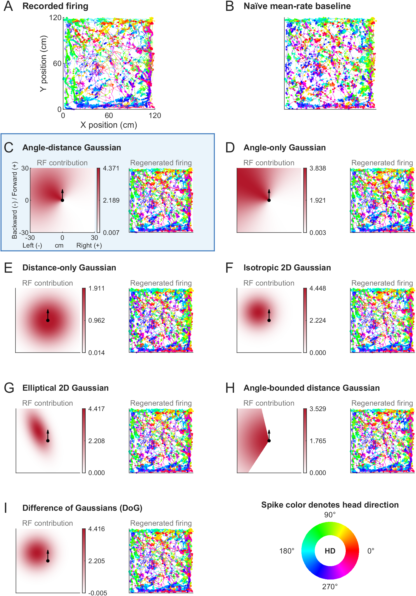

# Nearest-boundary CV/GLM demo

This folder is a self-contained Windows MATLAB demo for the example neuron used in Figure 2. It runs the current nearest-boundary modeling
workflow from raw tracking and spike timestamps through:

1. blocked cross-validated fitting;
2. per-fold and full-fit best selection;
3. Monte Carlo validation;
4. component figure export; and
5. MATLAB assembly of `figure2_N165_nearest_only`.

The demo does not require the parent ModelOnGoing checkout, SCC shell scripts,
`SGE_TASK_ID`, Python, or environment variables.

## Figure 2 preview

The preview below was generated by running `Demo.m` in `paper` mode for
example neuron N165 (nearest-only input and positive-only gain).



This is a saved reference image. Runtime outputs in `Demo Figures/` and
`Demo Results/` are excluded from Git; rerunning the demo does not automatically
update this preview.

## Windows quick start

1. Copy the complete `code and demo` folder to any Windows location.
2. Open MATLAB.
3. Open `Demo.m`.
4. Select the run mode near the top of the file:

```matlab
mode = "paper";  % complete paper configuration
% mode = "quick";  % shorter workflow demonstration
```

5. Run `Demo.m`.

All paths are resolved from the location of `Demo.m`, so MATLAB does not need
to start in this folder.

## Run modes

| Mode | Runs | CV folds | Monte Carlo draws | Optimization |
| --- | ---: | ---: | ---: | --- |
| `paper` | 5 | 5 | 2000 | Production defaults |
| `quick` | 2 | 3 | 200 | Reduced GA/hybrid limits |

Both modes fit all seven RF shape families with paired `glm_free` and
`glm_pos` calibration. The default figures use `glm_pos`, matching Figure 2.
Quick mode demonstrates the complete workflow but is not intended to
reproduce the final paper values.

## Requirements

- Windows MATLAB, R2021a or newer recommended.
- Global Optimization Toolbox (`ga`).
- Optimization Toolbox (`fmincon`).
- Parallel Computing Toolbox is optional. When available, the demo opens or
  reuses a Windows `local` pool. Otherwise it runs serially.
- Statistics and Machine Learning Toolbox is optional. If `glmfit` is
  unavailable or fails, the included logistic-calibration fallback is used.

## Inputs

`Demo Data` contains exactly one example neuron:

- `tracking_data/<name>.txt`: timestamp, x position, y position, head direction.
- `spike_timestamps/<name>.txt`: one spike timestamp per row.
- `boundaries.CSV`: four static segment boundaries.

Positions are in centimeters and head direction is in degrees.

## Outputs

Each mode has an isolated output directory:

```text
Demo Results/
  paper/ or quick/
    demo_prepared_data.mat
    demo_run_manifest.mat
    <rf>_1closest_cv_glm_<free|pos>_<run>.mat
    <rf>_1closest_cv_glm_<free|pos>_best.mat
    <rf>_1closest_cv_glm_<free|pos>_filled.mat

Demo Figures/
  paper/ or quick/
    figure2_N165_nearest_only.pdf
    figure2_N165_nearest_only.png
    directional_compass.pdf/png
    figures_basic/
    1pts Pos/<rf>/
```

PDF files preserve vector text and scatter content; PNG previews are exported
at 300 dpi.

## Reusing completed stages

The stage switches are near the top of `Demo.m`. For example, after fitting
has completed, set:

```matlab
config.stages.prepareData = false;
config.stages.fit = false;
```

The demo then loads `demo_prepared_data.mat` and reuses the configured numeric
run files. Best selection reads only the run IDs declared by the active mode,
so old or unrelated MAT files are not mixed into the result.

## Statistical behavior

- CV test folds are contiguous time blocks.
- RF shape and logistic calibration are fitted only on training frames.
- Fold winners are chosen by training log-likelihood.
- Reported CV likelihood is the sum of the selected held-out fold scores.
- Full-fit parameters, AIC, and BIC follow the run with the largest full-data
  log-likelihood.
- Monte Carlo null data use each fold's training firing rate and are scored
  with fixed out-of-fold model probabilities.
- RF heatmaps display $\alpha f_\Theta(\mathbf{b})$ without offset or sigmoid.
  The code's `offset` corresponds to $\beta$ in the manuscript and is reported
  through the zero-input baseline in each individual RF subtitle.
